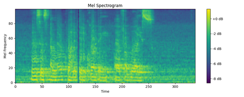
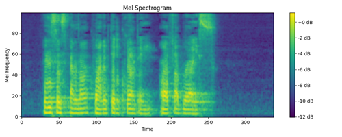
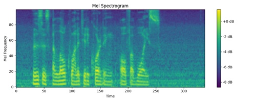

# VoiceRestore: Universal Audio Quality Restoration

VoiceRestore is a state-of-the-art audio restoration model that leverages flow-matching transformers to address a wide range of audio degradations. This repository contains the pretrained model and code necessary to run VoiceRestore on your own degraded speech audio files.

Demo of audio restorations: [VoiceRestore](https://sparkling-rabanadas-3082be.netlify.app/)

Credits: This repository is based on the [E2-TTS implementation by Lucidrains](https://github.com/lucidrains/e2-tts-pytorch)


Careful, heavily distorded audio. Adjust your volume before playing.

### Degraded Input: 




Degraded audio (reverberation, distortion, noise, random cut):

<video controls="" autoplay="" name="media">
    <source src="./audio/degraded.wav" type="audio/wav">
</video>


---

### Restored (steps=32, cfg=1.0):



Restored audio - 32 steps, strength 1.0:

<video controls="" autoplay="" name="media">
    <source src="./audio/restored.wav" type="audio/wav">
</video>

---

### Ground Truth:




---
## Key Features

- **Universal Restoration**: Any level and type of voice recording degradation. Pure magic.  
- **Easy to Use**: Simple interface for processing degraded audio files.
- **Pretrained Model**: Includes a 301 million parameter transformer model with pre-trained weights.

## Getting Started

 ```bash
git clone https://github.com/NVIDIA/BigVGAN.git
pip install torch torchaudio jaxtyping einops x-transformers torchdiffeq gateloop-transformer
```

- [Download pre-trained checkpoint](https://drive.google.com/drive/folders/1uBJNp4mrPJQY9WEaiTI9u09IsRg1lAPR?usp=sharing) and place it into checkpoints folder. **NOTE: This checkpoint is very early in the training. The model will be updated further as it trains.**

- Quick test: run below script should run on the test_input.wav file in the repository. The restored audio will be saved as test_output.wav.
```bash
python audio_restoration_model.py
```

- To process your audio files, use `model.forward(audio, steps=32, cfg_strength=1.0)` which will return audio tensor created by applying BigVGAN on the mel spectrogram output of the model. 


## Citation

If you use VoiceRestore in your research or projects, please cite our paper:

```
@article{kirdey2024voicerestore,
  title={VoiceRestore - Flow-Matching Transformers for Universal Audio Quality Restoration},
  author={Kirdey, Stanislav},
  journal={arXiv preprint arXiv:2024.XXXXX},
  year={2024}
}
```

## License

This project is licensed under the MIT License - see the [LICENSE](LICENSE) file for details.
